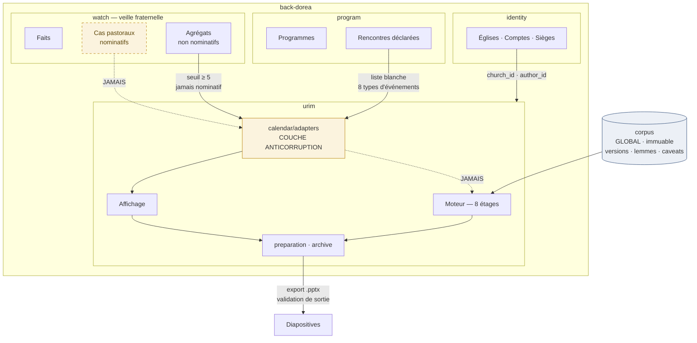

# DOREA URIM — Structure, interconnexion, schéma

**2 août 2026** — complète `Dorea_Urim_Architecture_v2.md`
**Statut :** spécification. Construction non autorisée (Architecture v2 §11).

---

## 1. Structure des modules

```
back-dorea/
└── src/contexts/
    ├── identity/            existant — comptes, églises, sièges
    ├── program/             existant (?) — programmes, rencontres   ← à vérifier §5
    ├── watch/               existant — faits, cas, veille fraternelle
    └── urim/                NOUVEAU
        │
        ├── corpus/                    GLOBAL · immuable · non tenant-scopé
        │   ├── domain/                Book, Version, Verse, Lemma, Pericope
        │   ├── infrastructure/        chargeurs de migration, index
        │   └── application/           lecture seule
        │
        ├── resolution/                étage 1
        │   ├── domain/                Normalizer, AnchorScorer, Candidate
        │   └── application/           ResolvePassage
        │
        ├── pericope/                  étage 2 — bornage + motif
        ├── doctrine/                  étage 5 — axes portés, caveats curés
        ├── homiletics/                axes de plan, compatibilités, squelette
        │
        ├── preparation/               TENANT + AUTEUR · le travail en cours
        ├── archive/                   TENANT + AUTEUR · prédications passées
        ├── deliverable/               diapositives, import, validation de sortie
        │
        ├── quota/                     réservation, fenêtre, dégradation
        │
        └── calendar/                  ⚠ COUCHE ANTICORRUPTION
            ├── domain/
            │   ├── ports.py           EcclesialContextPort  (interface)
            │   └── models.py          EcclesialEvent, AggregateSignal
            └── adapters/              ← SEUL endroit autorisé à importer hors-urim
                ├── watch_aggregate_adapter.py   [construit, S14]
                └── null_adapter.py
```

### Règle d'import — testée, pas documentée

```python
# tests/architecture/test_urim_isolation.py

INTERDIT = ("contexts.watch", "contexts.program", "contexts.identity")
EXEMPTION = "contexts/urim/calendar/adapters/"

def test_urim_n_importe_rien_hors_de_lui_meme():
    """Un seul point de contact avec le reste du système."""
    for fichier in fichiers_python("src/contexts/urim/"):
        if EXEMPTION in fichier:
            continue
        for module in imports_de(fichier):
            assert not module.startswith(INTERDIT), (
                f"{fichier} importe {module} — "
                f"la frontière Urim passe par calendar/adapters/"
            )
```

Ce test est le verrou réel. Le reste de ce document est une intention ; lui seul survit à six mois de développement par quelqu'un qui n'aura pas lu ces pages.

---

## 2. Schéma d'interconnexion



### Les quatre arêtes qui comptent

| Arête | Règle |
|---|---|
| `program → ACL` | Liste blanche de **8** types (`EVANGELISM` ajouté, S15). Tout type ajouté plus tard est invisible **par défaut** |
| `watch agrégats → ACL` | Seuil ≥ 5 personnes, jamais nominatif |
| `ACL → affichage` | ✅ Autorisé — le fait s'affiche à côté du texte |
| `ACL → moteur` | ⛔ **Interdit** — recherche oui, génération non |
| `watch cas → *` | ⛔ Jamais, sous aucune forme |
| `urim → watch` | ⛔ Aucun retour. Une préparation ne crée ni fait, ni cas, ni signal |

**Le flux est unidirectionnel et s'arrête à l'affichage.** Un agrégat traverse pour être *montré*, jamais pour être *lu par un modèle*.

---

## 3. Schéma de données

### 3.1 Corpus — global, immuable

> ⚠ **Correction 2026-08-06 (D-A) — préfixes, pas de schémas.** Le dépôt n'utilise aucun schéma
> Postgres : quatorze contextes vivent dans `public`. Le DDL ci-dessous garde `CREATE SCHEMA` et
> les noms courts pour la lisibilité de la spec, mais **ce qui s'écrit en migration** est
> `urim_corpus_version`, `urim_corpus_verse`, `urim_corpus_pericope`… et `urim_preparation`,
> `urim_preached`… L'argument n'est pas l'uniformité mais la **collision** : `version`,
> `language`, `book`, `verse`, `token`, `lemma`, `idf` sont précisément les noms qu'un autre
> contexte réclamera. Le préfixe est ce qui les rend utilisables.
>
> La couture de §3.9 ne bouge pas : elle interdit les FK vers une future **base** séparée, pas
> vers un schéma.

```sql
CREATE SCHEMA urim_corpus;

CREATE TABLE urim_corpus.language (
    code            text PRIMARY KEY,          -- 'fra', 'eng', 'grc', 'hbo'
    label           text NOT NULL,
    direction       text NOT NULL DEFAULT 'ltr'
);

CREATE TABLE urim_corpus.book (
    id              smallint PRIMARY KEY,      -- 1..66 (+ deutérocanoniques)
    osis_code       text UNIQUE NOT NULL,      -- 'Rom', 'Luke'
    testament       text NOT NULL CHECK (testament IN ('AT','NT','DC')),
    canon_order     smallint NOT NULL
);

-- Aucune abréviation en dur dans le code. Table, pas regex.
CREATE TABLE urim_corpus.book_name (
    book_id         smallint REFERENCES urim_corpus.book,
    language        text REFERENCES urim_corpus.language,
    label           text NOT NULL,             -- 'Romains'
    abbreviations   text[] NOT NULL,           -- {'Rom','Rm','Ro'}
    PRIMARY KEY (book_id, language)
);

CREATE TABLE urim_corpus.version (
    id                  uuid PRIMARY KEY,
    code                text UNIQUE NOT NULL,  -- 'LSG1910','DARBY','SBLGNT'
    language            text REFERENCES urim_corpus.language,
    label               text NOT NULL,
    translation_kind    text CHECK (translation_kind IN ('formelle','dynamique','original')),
    license_kind        text CHECK (license_kind IN ('domaine_public','sous_licence')),
    provider            text,                  -- NULL si domaine public
    offline_allowed     boolean NOT NULL,
    metered             boolean NOT NULL,      -- déclenche le plafond §3.7
    versification       text NOT NULL DEFAULT 'standard',
    CONSTRAINT licence_coherente CHECK (
        (license_kind = 'domaine_public' AND offline_allowed AND NOT metered)
        OR license_kind = 'sous_licence'
    )
);
```

> La contrainte `licence_coherente` interdit par construction qu'une version du domaine public soit comptée dans le plafond. C'est la règle « ce qui ne coûte rien à servir n'est jamais plafonné », écrite dans la base.

```sql
CREATE TABLE urim_corpus.verse (
    id              bigserial PRIMARY KEY,
    version_id      uuid REFERENCES urim_corpus.version,
    book_id         smallint REFERENCES urim_corpus.book,
    chapter         smallint NOT NULL,
    verse           smallint NOT NULL,
    body            text NOT NULL,
    body_norm       text NOT NULL,             -- sans accents/ponctuation/casse
    UNIQUE (version_id, book_id, chapter, verse)
);

-- ⚠ Les deux index GIN ne sont PAS dans la migration a1b2c3d4e5f7 (2026-08-06) : ils exigent
-- l'extension `pg_trgm` et une expression que SQLite ne sait pas lire — or la base de test se
-- construit depuis les modèles. Ils appartiennent au **chargement du corpus** (chantier 1), avec
-- les millions de lignes qui les justifient : un index GIN sur une table vide ne sert personne,
-- et `CREATE EXTENSION` est une décision de déploiement. Seul `verse_ref` est posé aujourd'hui.
CREATE INDEX verse_trgm  ON urim_corpus.verse USING gin (body_norm gin_trgm_ops);
CREATE INDEX verse_fts   ON urim_corpus.verse USING gin (to_tsvector('french', body));
CREATE INDEX verse_ref   ON urim_corpus.verse (version_id, book_id, chapter, verse);

-- Les traductions ne numérotent pas pareil (titres de psaumes, découpages).
CREATE TABLE urim_corpus.versification_map (
    from_scheme     text, to_scheme text,
    book_id         smallint,
    from_ch smallint, from_v smallint,
    to_ch   smallint, to_v   smallint,
    PRIMARY KEY (from_scheme, to_scheme, book_id, from_ch, from_v)
);

-- Ancres rares : les mots fréquents ne discriminent rien.
CREATE TABLE urim_corpus.idf (
    language        text, token text, idf real NOT NULL,
    PRIMARY KEY (language, token)
);

CREATE TABLE urim_corpus.lemma (
    id              bigserial PRIMARY KEY,
    language        text,                      -- 'grc' | 'hbo'
    lemma           text NOT NULL,             -- υἱοθεσία
    strong_code     text,                      -- G5206
    gloss           text
);

CREATE TABLE urim_corpus.token (
    verse_id        bigint REFERENCES urim_corpus.verse,
    position        smallint,
    surface         text NOT NULL,
    lemma_id        bigint REFERENCES urim_corpus.lemma,
    morph_code      text,
    PRIMARY KEY (verse_id, position)
);

-- Unités littéraires curées — base du bornage (étage 2)
CREATE TABLE urim_corpus.pericope (
    id              uuid PRIMARY KEY,
    book_id         smallint REFERENCES urim_corpus.book,
    start_ch smallint, start_v smallint,
    end_ch   smallint, end_v   smallint,
    label           text,
    rationale       text NOT NULL,             -- le motif affiché au pasteur
    source_ref      text NOT NULL,
    reviewed_by     text NOT NULL,
    reviewed_at     timestamptz NOT NULL
);
```

```sql
-- ⚠ Table AJOUTÉE le 2026-08-03. Les variantes textuelles n'avaient nulle part où vivre :
-- `doctrinal_caveat` ne convient ni par son `caveat_kind` (une variante n'est ni
-- « exegetique » — ce que le texte VEUT DIRE — ni « confessionnel » — un débat entre
-- traditions : c'est ce que le texte EST), ni par sa clé (un verset, pas un couple
-- péricope + axe doctrinal).
--
-- Cas d'école, Rm 8:1. Le Texte Reçu ajoute « qui ne marchent point selon la chair,
-- mais selon l'esprit » (assimilé depuis 8:4) ; les textes critiques l'omettent.
-- Sans la clause : « aucune condamnation » est INCONDITIONNEL. Avec : c'est une
-- CONDITION morale. Deux sermons opposés sur la même référence — la version détectée
-- n'est donc pas une information cosmétique.
CREATE TABLE urim_corpus.textual_variant (
    id                uuid PRIMARY KEY,
    book_id           smallint REFERENCES urim_corpus.book,
    chapter           smallint NOT NULL,
    verse             smallint NOT NULL,
    body              text NOT NULL,           -- la portion en question
    families_with     text[] NOT NULL,         -- {'texte_recu'}  → Ostervald…
    families_without  text[] NOT NULL,         -- {'critique'}    → LSG1910, Darby, SBLGNT
    -- Fait le tri de l'affichage : on n'assomme pas le pasteur avec chaque καί manquant.
    -- Seul `majeur` (et `notable` sur demande) s'affiche ; `nul` ne s'affiche jamais.
    doctrinal_weight  text NOT NULL CHECK (doctrinal_weight IN ('nul','notable','majeur')),
    note              text NOT NULL,           -- ce que la variante change, en une phrase
    source_ref        text NOT NULL,           -- apparat critique
    reviewed_by       text NOT NULL,
    reviewed_at       timestamptz NOT NULL
);
CREATE INDEX variant_ref ON urim_corpus.textual_variant (book_id, chapter, verse);
```

> `reviewed_by NOT NULL` ici aussi : **rien ne s'affiche qui n'ait été relu.** Un verset sans
> variante enregistrée n'affiche rien — jamais une improvisation d'apparat critique.
> **Conséquence sur l'acquisition (chantier 1)** : le corpus doit inclure un **apparat critique**,
> pas seulement des textes.

### 3.2 Doctrine — curé, sourcé, relu

```sql
-- ⚠ Précisé 2026-08-05 : les « 10 catégories » sont les **loci de la théologie
-- systématique**. `ordinal` porte leur ordre traditionnel (Dieu → Christ → Esprit →
-- homme → péché → salut → Église → anges → démons → fin), qui est aussi celui d'un plan
-- de catéchèse : l'écran peut trier par force OU par ordre canonique, sans le coder en dur.
CREATE TABLE urim_corpus.doctrinal_axis (
    code    text PRIMARY KEY,   -- 10 catégories, données et non enum de code
    label   text NOT NULL,
    ordinal smallint NOT NULL UNIQUE
);

INSERT INTO urim_corpus.doctrinal_axis (code, label, ordinal) VALUES
    ('theologie_propre', 'Théologie propre — Dieu',            1),
    ('christologie',     'Christologie — Jésus-Christ',        2),
    ('pneumatologie',    'Pneumatologie — le Saint-Esprit',    3),
    ('anthropologie',    'Anthropologie — l''homme',           4),
    ('hamartiologie',    'Hamartiologie — le péché',           5),
    ('soteriologie',     'Sotériologie — le salut',            6),
    ('ecclesiologie',    'Ecclésiologie — l''Église',          7),
    ('angelologie',      'Angélologie — les anges',            8),
    ('demonologie',      'Démonologie — Satan et les démons',  9),
    ('eschatologie',     'Eschatologie — les derniers temps', 10);

CREATE TABLE urim_corpus.doctrinal_bearing (
    pericope_id uuid REFERENCES urim_corpus.pericope,
    axis_code   text REFERENCES urim_corpus.doctrinal_axis,
    -- ⚠ Correction 2026-08-03 (confirmée) : `'resiste'` AJOUTÉ.
    -- Le mode conviction (Architecture v2 §7) exige d'afficher les textes **résistants**
    -- au même rang que les portants — c'est ce qui distingue Urim d'un moteur de
    -- proof-texting. Or `absent` (le texte ne dit rien sur cet axe) n'est PAS `resiste`
    -- (le texte complique ou contredit l'axe) : ce sont deux choses opposées, et seule la
    -- seconde protège. Sans cette valeur, le mode conviction est inconstructible.
    -- Additif, aucune reprise de données (aucune ligne n'existe encore).
    strength    text CHECK (strength IN ('dominant','porte','resiste','absent')),
    rationale   text NOT NULL,
    source_ref  text NOT NULL,
    reviewed_by text NOT NULL, reviewed_at timestamptz NOT NULL,
    PRIMARY KEY (pericope_id, axis_code)
);

-- « Ce que le texte ne dit pas »
CREATE TABLE urim_corpus.doctrinal_caveat (
    id              uuid PRIMARY KEY,
    pericope_id     uuid REFERENCES urim_corpus.pericope,
    axis_code       text REFERENCES urim_corpus.doctrinal_axis,
    body            text NOT NULL,
    caveat_kind     text CHECK (caveat_kind IN ('exegetique','confessionnel')),
    tradition_scope text[],                    -- NULL = toutes traditions
    source_ref      text NOT NULL,
    reviewed_by     text NOT NULL, reviewed_at timestamptz NOT NULL,
    CONSTRAINT confessionnel_borne CHECK (
        caveat_kind = 'exegetique' OR tradition_scope IS NOT NULL
    )
);
```

> `reviewed_by` et `reviewed_at` sont `NOT NULL` sur **toute table dont le contenu atteint le pasteur** — péricopes, variantes textuelles, pesées doctrinales, mises en garde, notes de contexte et faisabilités. **Rien ne s'affiche qui n'ait été relu.** Un texte sans caveat n'affiche rien, jamais une improvisation.
>
> ⚠ *Le compte n'est plus donné volontairement : il a été faux deux fois. La règle porte sur une propriété — « ce contenu est-il montré à quelqu'un ? » — pas sur une liste qu'il faut penser à tenir à jour.*

### 3.2bis Contexte — sourcé, ou absent

```sql
-- ⚠ Table AJOUTÉE le 2026-08-06 (S40). L'étage 4 travaillait contre un port dont **rien** ne
-- définissait la forme — même situation que les quatre tables de la capture (S31).
--
-- Sa règle tient en trois mots : **sourcé, ou absent**. Il n'y a pas de troisième possibilité,
-- ni contexte reconstitué, ni « on suppose que ». Un contexte historique inventé est le genre
-- d'erreur qu'un pasteur répète en chaire avec assurance, parce qu'elle avait l'air documentée.
CREATE TABLE urim_corpus_context_note (
    id           uuid PRIMARY KEY,
    pericope_id  uuid NOT NULL,             -- intégrité applicative (§3.9), jamais de FK
    -- Les deux natures que la spec nomme. Séparées parce qu'elles ne se lisent pas au même
    -- moment : l'historique situe, le littéraire explique la construction.
    context_kind text NOT NULL CHECK (context_kind IN ('historique','litteraire')),
    body         text NOT NULL,
    -- L'ordre de lecture appartient au curateur, pas à un tri par identifiant. Même raison que
    -- `doctrinal_axis.ordinal` : l'écran trie sans coder l'ordre en dur.
    ordinal      smallint NOT NULL,
    source_ref   text NOT NULL,
    reviewed_by  text NOT NULL,
    reviewed_at  timestamptz NOT NULL,
    UNIQUE (pericope_id, context_kind, ordinal)
);
CREATE INDEX context_note_pericope ON urim_corpus_context_note (pericope_id, ordinal);
```

### 3.3 Homilétique — deux axes orthogonaux

```sql
CREATE TABLE urim_corpus.plan_source (
    code    text PRIMARY KEY   -- 'textuel','expositif','thematique'
);
CREATE TABLE urim_corpus.subject_matter (
    code    text PRIMARY KEY   -- 'biographique','doctrinal','ethique',
);                             -- 'historique','typologique','prophetique'

-- Un couple impossible produit un refus motivé, jamais un plan fabriqué.
CREATE TABLE urim_corpus.homiletic_feasibility (
    pericope_id     uuid REFERENCES urim_corpus.pericope,
    plan_source     text REFERENCES urim_corpus.plan_source,
    subject_matter  text REFERENCES urim_corpus.subject_matter,
    feasible        boolean NOT NULL,
    refusal_reason  text,
    proof_text_risk text CHECK (proof_text_risk IN ('faible','moyen','eleve')),
    -- ⚠ Colonnes AJOUTÉES le 2026-08-06 (S39). Cette table était la seule table curée sans
    -- signature — et c'est la seule dont le contenu **oppose un refus** au pasteur. Un
    -- « ce passage ne porte aucun personnage » qui ne répond de personne est une décision
    -- anonyme prise contre quelqu'un ; les quatre autres tables l'auraient interdit.
    reviewed_by     text NOT NULL,
    reviewed_at     timestamptz NOT NULL,
    PRIMARY KEY (pericope_id, plan_source, subject_matter),
    CONSTRAINT refus_motive CHECK (feasible OR refusal_reason IS NOT NULL)
);
```

> **Pourquoi la signature manquait, et pourquoi c'est le pire endroit où elle pouvait manquer.**
> Les quatre autres tables curées portent une **information** : ce que le texte dit, ce qu'il ne
> dit pas, où l'unité commence. Celle-ci porte un **refus**, et un refus est ce qu'il faut pouvoir
> contester. `proof_text_risk` aussi : c'est un jugement sur le risque du travail de quelqu'un.

### 3.4 Préparation — tenant + auteur

```sql
CREATE SCHEMA urim;

CREATE TABLE urim.preparation (
    id                  uuid PRIMARY KEY,
    church_id           uuid NOT NULL,
    author_id           uuid NOT NULL,         -- propriétaire réel
    entry_mode          text CHECK (entry_mode IN ('reference','citation','conviction')),
    raw_input           text NOT NULL,
    -- ⚠ Colonne AJOUTÉE le 2026-08-06 (S36). Le détecteur d'entrée conserve **d'où vient le
    -- texte** à côté de ce qu'il en a fait : une dictée mal transcrite par un micro resté ouvert
    -- ne se corrige pas comme une faute de frappe, et sans cette colonne on ne peut pas le
    -- distinguer après coup. Reflète `StudyState.entry_origin` (TYPED | DICTATED).
    entry_origin        text,
    -- ⚠ Colonne AJOUTÉE le 2026-08-15 (migration d8e9f0a1b2c3). La version dans laquelle la
    -- citation a été **reconnue**, quand ce n'est pas celle de repli. NULL est le cas courant.
    --
    -- Elle n'est pas là pour l'affichage. `load_corpus_index` ne charge le texte que de la
    -- version de repli : « l'amour ne périt jamais » est Darby mot pour mot, quand Segond dit
    -- « la charité », et le détecteur lisait donc une **intention**. Une seconde passe en base
    -- va chercher la phrase dans les autres versions détenues — mais la trace n'est pas
    -- persistée, elle se recalcule à chaque lecture. Sans cette colonne, la première ouverture
    -- disait « retrouvé dans Darby » et la relecture suivante « ni référence ni citation » :
    -- la même préparation, deux motifs contradictoires, dont un qui dément le verset affiché
    -- juste à côté. C'est le défaut que `bounds_override` avait déjà eu — une décision
    -- enregistrée, invisible pour l'étage qui la relit.
    citation_version    text,
    pericope_id         uuid REFERENCES urim_corpus.pericope,
    -- ⚠ Correction 2026-08-06 (migration a1b2c3d4e5f7) : `int4range` REMPLACÉ par quatre colonnes
    -- `override_start_ch/_v`, `override_end_ch/_v`. Un intervalle d'entiers ne peut pas exprimer
    -- un empan **chapitre + verset** : Galates 5:16 → 6:2 n'est pas un intervalle. `pericope` et
    -- `preached` utilisent déjà quatre colonnes dans ce même document.
    bounds_override     int4range,             -- NULL = bornage proposé accepté
    version_id          uuid REFERENCES urim_corpus.version,
    axis_code           text REFERENCES urim_corpus.doctrinal_axis,
    plan_source         text REFERENCES urim_corpus.plan_source,
    subject_matter      text REFERENCES urim_corpus.subject_matter,
    theme               text,
    service_date        date,
    service_timezone    text NOT NULL,         -- un dimanche est local, pas UTC
    status              text CHECK (status IN ('ouverte','close','abandonnee')),
    opened_at           timestamptz NOT NULL,
    closed_at           timestamptz
);
CREATE INDEX prep_auteur ON urim.preparation (author_id, opened_at DESC);

-- Squelette Braga — dix éléments, tous facultatifs
CREATE TABLE urim.preparation_element (
    preparation_id  uuid REFERENCES urim.preparation ON DELETE CASCADE,
    element_code    text,   -- titre, introduction, proposition, interrogative,
    ordinal         smallint,  -- transition, divisions, subdivisions,
    body            text,      -- illustrations, application, conclusion
    PRIMARY KEY (preparation_id, element_code, ordinal)
);

-- Jamais de résolution silencieuse : les candidats sont conservés.
CREATE TABLE urim.resolution_attempt (
    id              uuid PRIMARY KEY,
    preparation_id  uuid REFERENCES urim.preparation ON DELETE CASCADE,
    input_hash      text NOT NULL,
    candidates      jsonb NOT NULL,            -- [{ref, score, motif}]
    chosen_ref      text,
    chosen_by       text CHECK (chosen_by IN ('moteur','pasteur')),
    version_detected uuid REFERENCES urim_corpus.version,  -- NULL = non identifiée
    attempted_at    timestamptz NOT NULL
);
```

**`version_detected` est remplie depuis le 2026-08-15**, et par une seule source : la seconde
passe. Elle était prévue ici dès la migration d'origine et restait vide, faute d'avoir quoi que
ce soit à y mettre — tant que l'index ne portait qu'une Bible, la version reconnue était toujours
celle de repli, donc l'information était nulle par construction.

Elle fait double emploi avec `preparation.citation_version`, et c'est **délibéré** : les deux
tables ne répondent pas à la même question. `resolution_attempt` est un historique, en ajout
seul — *qu'a-t-on tenté, quand, et qui a tranché*. `preparation.citation_version` est l'état
courant, relu par l'étage d'entrée à **chaque** rejeu ; l'y chercher voudrait dire interroger un
historique et prendre la dernière ligne, à chaque lecture, pour reconstituer un fait que la
préparation peut porter directement.

#### Ce que la seconde passe déplace, et ce qu'elle ne déplace pas

Mesuré sur six saisies, avec et sans la tolérance d'une lettre (`_meme_mot`) :

| saisie | strict | ±1 lettre | verdict |
|---|---:|---:|---|
| citation Darby, une lettre fausse | 0,424 | **1,000** | 1 Co 13:8 (Darby) |
| citation Darby, sans faute | 1,000 | 1,000 | 1 Co 13:8 (Darby) |
| accusation d'un tiers (S20) | 0,418 | 0,418 | intention — sous le seuil |
| « je veux prêcher sur le pardon » | 0,328 | 0,328 | intention — sous le seuil |
| « la foi qui déplace les montagnes » | 0,535 | 0,535 | **1 Co 13:2 (Martin)** |

La tolérance ne bouge **que** le cas pour lequel elle a été écrite, et laisse les quatre autres
au chiffre près. C'est la mesure qui la garde : une imprécision qui ne déplace rien d'autre que
sa cible n'est pas un assouplissement du seuil.

⚠️ **La cinquième ligne est le prix.** « La foi qui déplace les montagnes » est une intention dans
la bouche du pasteur, et une paraphrase de 1 Corinthiens 13:2 pour la mesure — 0,535, au-dessus
du seuil, dans les deux réglages. Élargir à quatre traductions élargit *aussi* ce que l'on peut
prendre pour une citation : plus il y a de formulations détenues, plus une paraphrase en recoupe
une. Le pasteur garde « ce n'est pas ça », et le motif nomme la version, donc l'erreur est
lisible et réversible — mais elle est réelle, et c'est une question ouverte, pas un défaut réglé.

### 3.5 Archive — propriété de l'auteur

```sql
CREATE TABLE urim.preached (
    id              uuid PRIMARY KEY,
    preparation_id  uuid REFERENCES urim.preparation,   -- NULL si importée
    church_id       uuid NOT NULL,
    author_id       uuid NOT NULL,
    preached_on     date NOT NULL,
    book_id         smallint REFERENCES urim_corpus.book,
    start_ch smallint, start_v smallint, end_ch smallint, end_v smallint,
    axis_code       text REFERENCES urim_corpus.doctrinal_axis,
    theme           text,
    capture_kind    text CHECK (capture_kind IN ('dictee','saisie','import')),
    exportable_until timestamptz            -- NULL = indéfiniment
);
CREATE INDEX preached_passage ON urim.preached (author_id, book_id, start_ch);
CREATE INDEX preached_axe     ON urim.preached (author_id, axis_code, preached_on DESC);
```

> `exportable_until NULL` par défaut : **l'archive survit à la résiliation.** Le travail du pasteur ne peut pas être pris en otage par le non-renouvellement de son église.
> Les deux index portent les deux vues de l'écran Archive : couverture du canon, et distribution doctrinale.

### 3.6 Livrable — validation de sortie

```sql
CREATE TABLE urim.deliverable (
    id              uuid PRIMARY KEY,
    preparation_id  uuid REFERENCES urim.preparation,
    kind            text CHECK (kind IN ('pptx','pdf')),
    generated_at    timestamptz NOT NULL,
    validation      text CHECK (validation IN ('conforme','rejete'))
);

-- Un verset inventé sur écran est fatal — et détectable par programme.
CREATE TABLE urim.citation_check (
    deliverable_id  uuid REFERENCES urim.deliverable ON DELETE CASCADE,
    slide_no        smallint,
    reference       text NOT NULL,
    projected_text  text NOT NULL,
    version_id      uuid REFERENCES urim_corpus.version,
    -- ⚠ Correction 2026-08-03 : `matches_corpus boolean` REMPLACÉ par `verdict`.
    -- Un booléen confond deux choses opposées : une **troncature** (le pasteur coupe la fin
    -- du verset pour l'écran — légitime et universel) et une **altération** (un mot changé).
    -- Rejeter les deux au même titre ferait contourner la validation, donc mourir le
    -- garde-fou. Règle : le texte projeté doit être une **sous-chaîne contiguë** du corpus
    -- (après normalisation apostrophes/espaces) ; « … » autorise plusieurs fragments
    -- contigus, dans l'ordre, sans chevauchement. Tout le reste est `altere`.
    verdict         text NOT NULL CHECK (verdict IN ('exact','extrait','altere')),
    PRIMARY KEY (deliverable_id, slide_no)
);
-- ⚠ La comparaison porte sur la référence **traduite** via `versification_map`, jamais sur
-- la référence brute : sans cela, « Psaume 51:12 » est rejeté à tort (titre du psaume compté
-- ou non) — ou pire, validé sur le mauvais verset.
```

### 3.7 Plafond — réservation, pas comptage d'appels

```sql
CREATE TABLE urim.usage_window (
    id              uuid PRIMARY KEY,
    church_id       uuid NOT NULL,             -- mutualisé, jamais par siège
    period_start    date NOT NULL,
    period_end      date NOT NULL,
    metered_units   integer NOT NULL DEFAULT 0,
    ceiling         integer NOT NULL,
    UNIQUE (church_id, period_start)
);

-- Rouvrir la même péricope dans la fenêtre ne consomme rien.
CREATE TABLE urim.study_reservation (
    id              uuid PRIMARY KEY,
    church_id       uuid NOT NULL,
    author_id       uuid NOT NULL,
    -- ⚠ Correction 2026-08-03 : la clé est **provisoire** à l'ouverture, puis RE-CLÉE sur la
    -- péricope résolue par l'étage 2 (UPDATE de cette ligne, jamais un INSERT).
    -- Calculée sur l'entrée brute, elle cassait l'idempotence : le geste normal du pasteur —
    -- ouvrir large puis resserrer — changeait la clé et créait une SECONDE réservation.
    --   « Galates 5 » → il choisit 5:16-26 → clé différente → 2ᵉ unité comptée.
    --   « Rom 1:16 »  → il accepte 1.16-17 → même défaut.
    -- L'index partiel unique ne voyait rien : les clés diffèrent, donc aucun doublon.
    -- Cas limite : si une réservation active existe déjà pour la péricope résolue, on
    -- LIBÈRE la provisoire au lieu de la re-cléer (sinon collision sur l'index).
    pericope_key    text NOT NULL,
    window_id       uuid REFERENCES urim.usage_window,
    reserved_at     timestamptz NOT NULL,
    expires_at      timestamptz NOT NULL,      -- +72h : vendredi → dimanche
    released_at     timestamptz,
    -- ⚠ Correction 2026-08-03 : colonne AJOUTÉE. **Réserver n'est pas consommer.**
    -- À l'ouverture on ne sait pas encore si la préparation touchera une ressource facturée.
    -- Compter une unité dès l'ouverture ferait mentir §13 (« un pasteur qui travaille sur
    -- Segond 1910 ne rencontre jamais aucune limite »). `metered_at` reste NULL tant que
    -- rien de facturé n'a été servi ; il se pose au PREMIER service `metered`, une seule fois.
    metered_at      timestamptz                -- NULL = cette préparation n'a rien coûté
);
CREATE UNIQUE INDEX reservation_idempotente
    ON urim.study_reservation (church_id, author_id, pericope_key)
    WHERE released_at IS NULL;
```

> L'index partiel unique rend la reprise **idempotente**. Coupure réseau, rechargement, retentative : même clé, même unité. Sur une connexion irrégulière, un compteur naïf doublerait tout.
>
> ⚠ **Correction 2026-08-03 — le plafond se vérifie à la PREMIÈRE CONSOMMATION, pas à l'ouverture.**
> L'ancienne formulation (« à l'ouverture, jamais en cours de route ») confondait la **réservation**
> — une clé d'identité, gratuite — et la **consommation** — le premier service d'une ressource
> facturée. Ancrée à l'ouverture, elle faisait mentir §13. Ancrée à la première consommation, elle
> garde toute son intention : **une préparation commencée va jusqu'au bout**, car une fois `metered_at`
> posé, le droit est **acquis pour la durée de la réservation** (+72 h), même si le plafond tombe
> entre-temps à cause d'un autre pasteur.
>
> Incrément **atomique**, qui règle aussi la course de deux pasteurs à `ceiling - 1` :
> ```sql
> UPDATE urim.usage_window SET metered_units = metered_units + 1
>  WHERE id = :window AND metered_units < ceiling RETURNING metered_units;
> ```
> `0 ligne` → plafond atteint → **`DEGRADE`** (repli LSG 1910), rien n'est incrémenté, aucun mur.

### 3.8 Instantanés d'interconnexion — le seuil dans la base

```sql
CREATE TABLE urim.ecclesial_event_snapshot (
    id          uuid PRIMARY KEY,
    church_id   uuid NOT NULL,
    -- ⚠ Correction 2026-08-04 (S15) : `'EVANGELISM'` AJOUTÉ — la campagne d'évangélisation
    -- manquait, elle était donc invisible par défaut (*fail closed*, le bon comportement,
    -- mais il fallait le décider). C'est l'événement qui remplit le module Mission.
    -- Codes en **anglais**, comme les sept autres ; seul l'affichage est traduit.
    kind        text NOT NULL CHECK (kind IN (
        'WEDDING','BAPTISM','SPECIAL_SERVICE','WORSHIP_NIGHT',
        'FAST','MEMORIAL_SERVICE','CONVENTION','EVANGELISM')),   -- liste blanche
    occurs_on   date NOT NULL,
    label       text,
    fetched_at  timestamptz NOT NULL
);

CREATE TABLE urim.aggregate_signal_snapshot (
    id          uuid PRIMARY KEY,
    church_id   uuid NOT NULL,
    topic       text NOT NULL,
    headcount   integer NOT NULL,
    window_days smallint NOT NULL,
    fetched_at  timestamptz NOT NULL,
    CONSTRAINT seuil_confidentialite CHECK (headcount >= 5)
);
```

> **Aucune colonne d'identifiant de personne dans ces deux tables.** Le seuil de cinq est une contrainte `CHECK` : il tient même si un développeur se trompe dans l'adaptateur.
> Ces instantanés alimentent **l'affichage seul**. Aucun chemin de code ne les passe à un modèle.

---

### 3.9 La couture d'extraction

**Décision : Urim est un contexte du monolithe, pas un service.** Le test d'architecture (§1) fournit la même frontière qu'un réseau, sans latence ni mode de panne supplémentaire. R1 — dispersion — interdit un déploiement de plus à ce stade.

Trois règles préservent l'option d'extraire plus tard, sans coûter aujourd'hui :

**Aucune clé étrangère ne franchit une frontière de contexte.** `church_id` et `author_id` sont des `uuid` sans `REFERENCES` — c'est déjà le cas ci-dessus, et c'est délibéré.

**Aucune clé étrangère de `urim` vers `urim_corpus`.** ⚠ Correction : les `REFERENCES urim_corpus.*` déclarées en §3.4 et §3.5 doivent être **retirées**. Le corpus est destiné à migrer vers une base de lecture séparée dès que les index trigrammes gêneront le transactionnel ; une FK inter-bases n'existe pas. Intégrité applicative, comme pour les autres contextes.

```sql
-- au lieu de :  pericope_id uuid REFERENCES urim_corpus.pericope
-- écrire     :  pericope_id uuid NOT NULL   -- intégrité applicative
```

**Aucune transaction ne couvre `urim` et un autre contexte.** Si une écriture Urim et une écriture ailleurs doivent réussir ensemble, la frontière est mal placée — et c'est le signal, pas la transaction distribuée.

### Critères d'extraction — fixés d'avance

Extraire le corpus en base de lecture séparée quand **les requêtes de résolution dégradent mesurablement le transactionnel**. Extraire Urim en service séparé si, et seulement si, l'un de ces trois faits est vrai :

1. Une équipe distincte en a la charge
2. Le profil de déploiement diverge réellement (cadence, SLA, conformité de licence)
3. La vente d'Urim seul devient une part significative du revenu

**Aucun de ces trois n'est vrai aujourd'hui.** Les écrire maintenant évite que la décision se reprenne sur une impression, dans six mois, un soir de fatigue.

---

## 4. Ce que le schéma interdit par construction

| Règle produit | Où elle est tenue |
|---|---|
| Ce qui ne coûte rien n'est jamais plafonné | `version.licence_coherente` |
| Rien ne s'affiche qui n'ait été relu | `reviewed_by NOT NULL` × **4** tables *(dont `textual_variant`)* |
| Une variante textuelle qui change le sens ne reste pas invisible | `textual_variant.doctrinal_weight` |
| Un couple homilétique impossible produit un refus motivé | `homiletic_feasibility.refus_motive` |
| Un caveat confessionnel ne fuit pas hors de sa tradition | `doctrinal_caveat.confessionnel_borne` |
| Aucun agrégat sous cinq personnes | `aggregate_signal_snapshot.seuil_confidentialite` |
| Aucun cas pastoral nominatif dans Urim | absence de colonne + test d'architecture §1 |
| L'archive survit à la résiliation | `preached.exportable_until` NULL par défaut |
| Reprise idempotente sur réseau instable | `reservation_idempotente` |
| Un dimanche est local, pas UTC | `preparation.service_timezone` |
| Aucune abréviation de livre en dur | `book_name.abbreviations` |

---

## 5. À vérifier dans le code avant d'écrire l'adaptateur

**Où vit aujourd'hui le calendrier des programmes et rencontres ?** S'il est déjà dans un contexte distinct de `watch`, la couche anticorruption se réduit à l'adaptateur d'agrégats seul. Sinon, il faut le sortir de `watch` avant — et ce travail bénéficie au reste du système, pas seulement à Urim.

Vérification de dix minutes dans `back-dorea`. Elle conditionne §1 et §2 de ce document.
